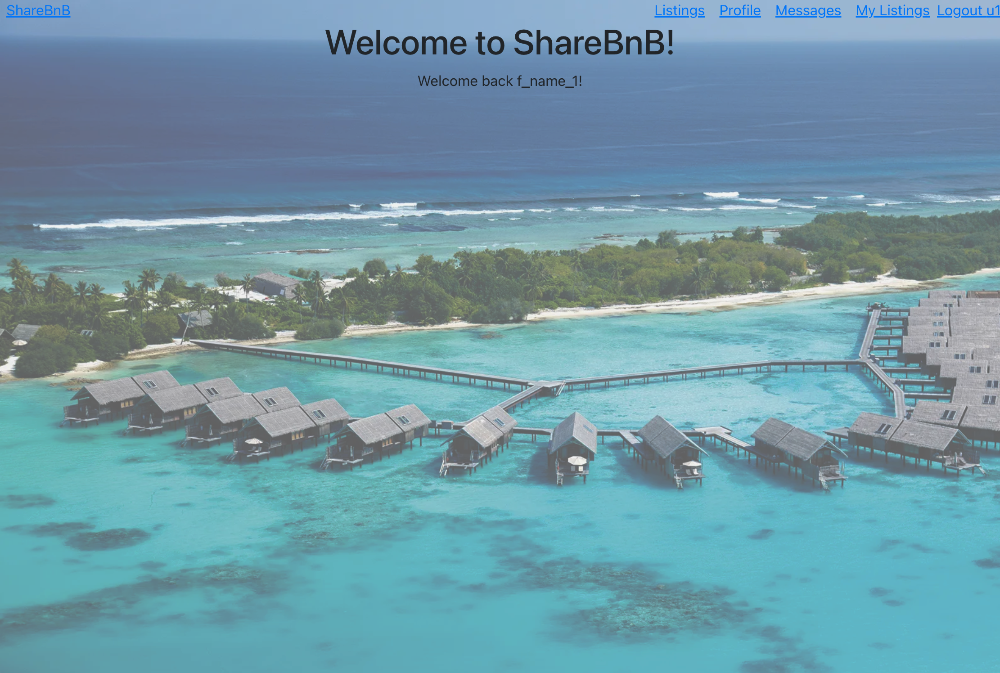

# ShareBnB
AirBnB clone built in Flask Python, React.js, and AWS S3

### ***For LinkedIn REACH 2024: Question 3 refers to backend/app.py, post_new_listing(), line 198***

## Live Demo: https://share-bnb.netlify.app/

Anonymous users can sign up with a username/password/email. 
Users can view listings, click for more details, and create listings of their own, including uploading photos, which is implemented with AWS S3 and Boto3.  

The React JavaScript frontend interfaces with the Flask Python API backend, which defines the relational database managed with PostgreSQL. 
File paths for the image files uploaded by the user are created in Flask and stored into the database. And then the files are uploaded and fetched to AWS S3 using Boto3.

